# 🔮 Oráculo Financeiro

Copiloto financeiro pessoal que une **gestão de finanças pessoais** (faturas de cartão, renda, patrimônio, metas, financiamentos) com um **copiloto de investimentos na B3** baseado em RAG (LangChain + OpenAI), sinais de Machine Learning (XGBoost) e observabilidade completa via MLflow.

---

## Sumário

- [Visão geral](#visão-geral)
- [Arquitetura](#arquitetura)
  - [Grafo `.dot`](#grafo-dot)
  - [Fluxo de dados](#fluxo-de-dados)
- [Stack tecnológico](#stack-tecnológico)
- [Módulos e funcionalidades](#módulos-e-funcionalidades)
- [Banco de dados](#banco-de-dados-supabase)
- [Como rodar](#como-rodar)
- [Testes e avaliação](#testes-e-avaliação)
- [Estrutura de pastas](#estrutura-de-pastas)
- [Subindo para o GitHub](#subindo-para-o-github)

---

## Visão geral

O Oráculo Financeiro centraliza a vida financeira em uma única interface:

| Área | O que faz |
|---|---|
| **Faturas de cartão** | Upload de PDF → extração automática via GPT-4o → categorização de gastos |
| **Renda mensal** | Registro de salário, PLR, 13º, bônus → taxa de poupança |
| **Carteira B3** | Upload do relatório consolidado mensal da B3 → ações, ETFs, FIIs e Tesouro Direto |
| **Análise RAG** | Perguntas em linguagem natural sobre ativos da B3 (preços, indicadores e notícias) |
| **Sinais de ML** | XGBoost gera sinais compra/venda/neutro por ticker |
| **Simulador** | Amortização de financiamentos nos sistemas Price e SAC |
| **Metas** | Projeção de patrimônio e prazo para atingir objetivos com juros compostos |
| **Insights** | Alertas determinísticos de saúde financeira que complementam a análise via LLM |

Existem **duas interfaces**: o frontend React (produto principal) e um app Streamlit paralelo focado em chat RAG + sinais.

---

## Arquitetura

### Grafo `.dot`

O grafo completo da arquitetura está em [`docs/architecture.dot`](docs/architecture.dot) (formato Graphviz).

Para renderizar:

```bash
# instale o graphviz (macOS: brew install graphviz)
dot -Tpng docs/architecture.dot -o docs/architecture.png
dot -Tsvg docs/architecture.dot -o docs/architecture.svg
```

> Sem Graphviz local? Cole o conteúdo abaixo em <https://dreampuf.github.io/GraphvizOnline>.



```dot
digraph OraculoFinanceiro {
    rankdir=LR;
    label="Oráculo Financeiro — B3 + Finanças Pessoais";
    node [shape=box, style="rounded,filled", fillcolor="#F5F7FA"];

    subgraph cluster_ext {
        label="Fontes externas"; style="rounded,dashed";
        yahoo  [label="Yahoo Finance (yfinance)"];
        rss    [label="Feeds RSS\nInfoMoney · G1 · Exame · Valor"];
        b3site [label="B3 Investidor\n(PDF consolidado mensal)"];
        bank   [label="Fatura de cartão (PDF)"];
        openai [label="OpenAI API\nembeddings · gpt-4o · gpt-4o-mini"];
    }

    subgraph cluster_ui {
        label="Interfaces"; style="rounded";
        react     [label="Frontend React + Vite :5173\nFatura · Dashboard · VisãoGeral\nPatrimônio · B3 · Simulador · Metas"];
        streamlit [label="App Streamlit :8501\nchat RAG + sinais"];
    }

    subgraph cluster_api {
        label="Backend — FastAPI :8000  (backend/api)"; style="rounded";
        routers  [label="routers/*  /api/{b3,faturas,dashboard,gastos,\nrenda,portfolio,metas,simulador,patrimonio-*,\nfinanciamentos,analise-integrada,transactions}"];
        pf       [label="modules/personal_finance\npdf_parser (pdfplumber)\nai_extractor / portfolio_extractor (gpt-4o)\ncategorizer"];
        insights [label="modules/insights_engine\nalertas determinísticos"];
    }

    subgraph cluster_rag {
        label="RAG — rag/chain.py  ask()"; style="rounded";
        retriever [label="retriever.py\nembed + busca Qdrant"];
        prompts   [label="prompts.py  (v1 / v2)"];
        chain     [label="chain.ask()\nChatOpenAI(gpt-4o-mini)\n+ juízes MLflow GenAI"];
    }

    subgraph cluster_data {
        label="Pipeline de dados — data/  (APScheduler 19h BRT)"; style="rounded";
        ingest  [label="ingestion/\nb3_fetcher · news_fetcher · realtime_fetcher"];
        process [label="processing/\nfeature_engineering (ta)\nembeddings (OpenAI)"];
    }

    subgraph cluster_ml {
        label="ML — ml/"; style="rounded";
        mlfeat  [label="features.py\nlabels: retorno fwd 5d ±2%"];
        mltrain [label="train.py — XGBoost + MLflow"];
        mlpred  [label="predict.py — gera sinais"];
        mlmodel [label="models/xgboost_v2.pkl", shape=note];
    }

    subgraph cluster_store {
        label="Persistência"; style="rounded";
        supabase [label="Supabase / PostgreSQL\nprices · signals · embeddings_meta\nincome_entries · portfolio_* · invoices · transactions", shape=cylinder];
        qdrant   [label="Qdrant :6333\noraculo_financeiro\n(price_summary + news_article)", shape=cylinder];
        redis    [label="Redis :6379\ncache de cotações", shape=cylinder];
    }

    mlflow [label="MLflow  ./mlruns\noraculo_rag (traces) · oraculo_sinais (training)"];

    react -> routers [label="HTTP/JSON (TanStack Query)"];
    streamlit -> chain [label="ask()"];
    streamlit -> supabase; streamlit -> redis;

    bank -> pf [label="upload PDF"]; b3site -> pf [label="upload PDF"];
    pf -> openai; pf -> supabase [label="upsert (SHA-256)"];
    routers -> pf; routers -> insights; routers -> chain [label="/api/b3 chat"];
    routers -> supabase; routers -> redis;

    retriever -> qdrant; retriever -> openai [label="embed"];
    chain -> retriever; chain -> prompts; chain -> openai [label="geração + juízes"];
    chain -> mlflow [label="@mlflow.trace"];

    yahoo -> ingest; rss -> ingest;
    ingest -> process; ingest -> redis [label="realtime"];
    process -> supabase [label="upsert_prices"]; process -> qdrant [label="embeddings"]; process -> openai;

    supabase -> mlfeat -> mltrain -> mlmodel -> mlpred -> supabase [label="signals"];
    mltrain -> mlflow;
}
```

### Fluxo de dados

```
yfinance ─┐
RSS feeds ─┼─► data/ingestion ─► data/processing ─┬─► Supabase (prices, indicadores)
          │                                        └─► Qdrant   (price_summary, news_article)
          └─► realtime_fetcher ─► Redis (cache de cotações 60s)

Supabase (prices) ─► ml/features ─► ml/train (XGBoost) ─► ml/models/*.pkl ─► ml/predict ─► Supabase (signals)

Fatura PDF  ─► pdf_parser ─► ai_extractor (gpt-4o) ─────► Supabase (invoices, transactions)
Relatório B3 PDF ─► pdf_parser ─► portfolio_extractor ──► Supabase (portfolio_*)

Pergunta ─► rag/retriever (embed + Qdrant) ─► rag/chain (gpt-4o-mini) ─► resposta + assessments MLflow
```

O scheduler (`data/scheduler.py`, APScheduler) roda o ETL diário às **19h BRT** e a atualização FIPE mensal no dia 1 às 6h.

---

## Stack tecnológico

### Backend
| Camada | Tecnologia |
|---|---|
| API | FastAPI + Pydantic Settings |
| IA / Extração | OpenAI GPT-4o |
| RAG | LangChain + OpenAI Embeddings + `gpt-4o-mini` |
| ML (sinais B3) | XGBoost · LightGBM · scikit-learn |
| Indicadores técnicos | `ta` |
| Banco de dados | Supabase (PostgreSQL) |
| Vetores | Qdrant (Docker `:6333`, fallback disco local) |
| Cache | Redis (`:6379`) |
| PDF | pdfplumber |
| Observabilidade | MLflow (traces GenAI + Model Training) |
| Agendamento | APScheduler |
| Logs | structlog |
| UI paralela | Streamlit |

### Frontend
| Camada | Tecnologia |
|---|---|
| Framework | React 19 + TypeScript |
| Build | Vite 5 |
| Estilo | Tailwind CSS v4 + shadcn/ui + `@base-ui/react` |
| Roteamento | React Router v7 |
| Dados | TanStack Query v5 |
| Estado | Zustand |
| Formulários | react-hook-form + Zod |
| Gráficos | Recharts |
| Mapas | Leaflet / react-leaflet |
| Fontes | Geist Variable · IBM Plex Sans |

---

## Módulos e funcionalidades

### 1. Upload de Fatura `/`
Extração automática de transações de faturas de cartão em PDF. O backend extrai o texto via `pdfplumber`, o GPT-4o categoriza cada transação (estabelecimento, data, valor, parcelamento N/M) e o resultado é persistido no Supabase com ID determinístico (SHA-256 do PDF). Valida se o total extraído bate com o total da fatura e sinaliza estornos.

**Categorias:** Alimentação · Transporte · Saúde · Lazer · Compras · Serviços · Educação · Moradia · Viagem · Outros

### 2. Análise de Gastos `/dashboard`
Dashboard mensal: total bruto, estornos, total líquido, nº de transações, ticket médio. Gráfico de barras por categoria (clique filtra a tabela), tabela de categorias com % do total e tabela de transações com busca e ordenação.

### 3. Visão Geral `/visao-geral`
Saúde financeira do mês integrando renda, gastos e patrimônio: renda total, gasto líquido, saldo, taxa de poupança (meta 20%), barra de comprometimento da renda com alerta visual e formulário de fontes de renda.

### 4. Patrimônio `/patrimonio`
Carteira consolidada a partir do **Relatório mensal consolidado** da B3 (`investidor.b3.com.br` → Extratos e Informativos). O GPT-4o extrai posições e proventos. KPIs por classe de ativo, gráfico de alocação, tabelas de posições (Ações/ETF/FII e Tesouro Direto) e proventos. Re-upload do mesmo mês substitui os dados (upsert por SHA-256).

### 5. B3 — Copiloto de Investimentos `/b3`
- **Cotações:** preço, variação %, máx/mín, volume — atualização a cada 60s via Yahoo Finance (cache Redis).
- **Sinais de ML:** XGBoost com RSI, MACD, Bollinger Bands e EMA. Labels: Compra (retorno > +2% em 5 dias) · Neutro · Venda (< −2%). Score de confiança por predição.
- **Chat RAG:** embeddings OpenAI → busca Qdrant (`price_summary` + `news_article`) → geração `gpt-4o-mini` → avaliação automática (grounding, relevância de contexto, classificação PASS/BORDERLINE/HALLUCINATION, risco de alucinação) registrada no MLflow.

### 6. Simulador de Financiamentos `/simulador`
Amortização **Price** (parcelas fixas) ou **SAC** (amortização constante): parcela inicial/final, total pago, total de juros, gráfico de evolução do saldo devedor e tabela de amortização.

### 7. Planejador de Metas `/metas`
Projeção de prazo para atingir uma meta de patrimônio com juros compostos: meta, aporte mensal, rentabilidade anual, capital inicial → prazo em meses, total aportado vs. rendimento e gráfico de área.

---

## Banco de dados (Supabase)

| Tabela | Descrição |
|---|---|
| `prices` | Histórico OHLCV + indicadores técnicos por ticker |
| `signals` | Sinais de ML (compra/venda/neutro) por ticker e data |
| `embeddings_meta` | Metadados dos documentos vetorizados |
| `income_entries` | Entradas de renda mensal |
| `portfolio_snapshots` | Metadados dos relatórios B3 carregados |
| `portfolio_positions` | Posições individuais por snapshot |
| `portfolio_dividends` | Proventos recebidos por snapshot |
| `invoices` / `transactions` | Faturas e transações extraídas dos PDFs |

**Qdrant:** coleção única `oraculo_financeiro`; o campo `doc_type` distingue `price_summary` de `news_article`.

---

## Como rodar

### Pré-requisitos
- Python 3.12 com virtualenv em `.venv/`
- Node.js 20+
- Docker (para Qdrant e Redis locais)
- Arquivo `.env` na raiz (veja [`.env.example`](.env.example))

### Variáveis de ambiente

```env
PUBLIC_SUBASE_URL=https://<projeto>.supabase.co/rest/v1/   # sim, "SUBASE" — lido assim em config.py
PUBLIC_SUPABASE_ANON_KEY=<chave>
SUPABASE_SERVICE_ROLE_KEY=<chave>
DATABASE_PASSWORD=<senha>
API_OPENAI_KEY=<chave>
API_KEY_QDRANT=<chave>
CLUSTER_ENDPOINT_QDRANT=<url>
```

### Infra local (Qdrant + Redis)

```bash
docker compose up -d
```

### Backend — FastAPI

```bash
PYTHONPATH=. .venv/bin/pip install -r requirements.txt
PYTHONPATH=. .venv/bin/uvicorn backend.api.main:app --port 8000 --reload
# docs: http://localhost:8000/docs
```

### Frontend

```bash
cd frontend
npm install
npm run dev          # http://localhost:5173
```

### App Streamlit (chat RAG + sinais)

```bash
./run.sh             # equivalente a: PYTHONPATH=. .venv/bin/streamlit run app/main.py
```

### Pipeline de dados B3 (ML + embeddings)

```bash
# Backfill histórico de preços (use datas explícitas — o fetch de 1 dia produz DataFrame vazio pela janela de warmup)
PYTHONPATH=. .venv/bin/python -c "
from data.ingestion.b3_fetcher import fetch_all_tickers
from data.processing.feature_engineering import compute_all_features
from storage.supabase_client import upsert_prices
df = fetch_all_tickers(start='2024-01-01', end='2026-05-01')
upsert_prices(compute_all_features(df))
"

PYTHONPATH=. .venv/bin/python data/processing/embeddings.py        # embeddings de resumos de preço
PYTHONPATH=. .venv/bin/python ml/train.py                          # treina XGBoost → ml/models/xgboost_v2.pkl
PYTHONPATH=. .venv/bin/python ml/predict.py                        # gera sinais → Supabase
PYTHONPATH=. .venv/bin/python data/scheduler.py --run-now          # roda o ETL diário uma vez
```

### MLflow UI

```bash
PYTHONPATH=. .venv/bin/mlflow ui --port 5001    # http://localhost:5001
```

| Experimento | Conteúdo |
|---|---|
| `oraculo_rag` | Aba GenAI/Traces — toda chamada `ask()` com spans e assessments |
| `oraculo_sinais` | Aba Model Training — treinos XGBoost e folds de backtesting |

---

## Testes e avaliação

```bash
# Testes unitários
PYTHONPATH=. .venv/bin/pytest tests/ -v

# Avaliação do RAG sobre o golden dataset
PYTHONPATH=. .venv/bin/python observability/rag_evaluator.py
PYTHONPATH=. .venv/bin/python observability/rag_evaluator.py --compare   # prompt v1 vs v2
```

---

## Estrutura de pastas

```
├── app/                     # App Streamlit (chat RAG + sinais)
├── backend/
│   ├── api/
│   │   ├── main.py          # FastAPI + CORS + include_router
│   │   └── routers/         # b3, faturas, dashboard, gastos, renda, portfolio,
│   │                        # metas, simulador, patrimonio_*, financiamentos,
│   │                        # analise_integrada, transactions
│   ├── config.py            # Pydantic Settings (lê .env)
│   └── modules/
│       ├── insights_engine.py
│       └── personal_finance/  # pdf_parser · ai_extractor · portfolio_extractor · categorizer
├── frontend/                # React 19 + Vite + Tailwind v4 + shadcn/ui
│   └── src/{api,pages,components,lib,types}
├── data/
│   ├── ingestion/           # b3_fetcher (yfinance) · news_fetcher (RSS) · realtime_fetcher
│   ├── processing/          # feature_engineering (ta) · embeddings (OpenAI)
│   └── scheduler.py         # APScheduler — ETL diário 19h BRT
├── ml/
│   ├── features.py          # labels: retorno fwd 5d ±2%
│   ├── train.py · predict.py · backtesting.py
│   └── models/              # xgboost_v1.pkl · xgboost_v2.pkl
├── rag/
│   ├── chain.py             # ask() — entrypoint único do LLM
│   ├── retriever.py · prompts.py (v1/v2) · evaluate.py
├── storage/                 # supabase_client · qdrant_client · redis_client
├── observability/           # mlflow_tracker · rag_evaluator · eval_dataset
├── tests/
├── docs/architecture.dot    # grafo Graphviz da arquitetura
├── docker-compose.yml       # Qdrant + Redis
├── requirements.txt · run.sh · config.py
```

---

## Subindo para o GitHub

O repositório ainda **não** está inicializado. Antes do primeiro commit, confirme que nada sensível vai junto — o [`.gitignore`](.gitignore) já cobre:

| Ignorado | Por quê |
|---|---|
| `.env`, `.env.*` | **contém chaves reais** (OpenAI, Supabase service role, senha do banco, Qdrant) |
| `pdf_exemplo/`, `*.pdf` | faturas de cartão e extratos B3 reais — dados pessoais |
| `.venv/` | 1,1 GB de dependências — reinstaláveis via `requirements.txt` |
| `frontend/node_modules/` | 326 MB — reinstalável via `npm install` |
| `mlruns/`, `**/mlruns/` | 21 MB de artefatos MLflow locais (inclui `app/mlruns/`) |
| `qdrant_data/` | 7 MB de índice vetorial local — recriável pelo pipeline de embeddings |
| `__pycache__/`, `.pytest_cache/`, `*.pyc` | caches do Python |
| `.DS_Store` | metadados do Finder (macOS) |
| `.claude/settings.local.json` | config local da máquina |

> **Notas.** As anotações de trabalho `cloud.md`, `doc.md` e `new.md` foram movidas para `docs/` e estão no `.gitignore` — ficam no disco mas não vão para o repo. Os modelos `ml/models/*.pkl` (1,7 MB) **são versionados** de propósito, para o app funcionar sem re-treino; se preferir, adicione `ml/models/*.pkl` ao `.gitignore` e documente o `ml/train.py` como passo obrigatório.

### Passos

```bash
# 1. rotacione as chaves que já estiveram em .env, por segurança
# 2. inicialize e confira o que será commitado
git init
git add .
git status                       # confirme que .env e pdf_exemplo/ NÃO aparecem
git commit -m "chore: primeira versão do Oráculo Financeiro"

# 3. conecte ao repositório remoto e publique
git branch -M main
git remote add origin https://github.com/noskcaj2001/oraculo_financeiro.git
git push -u origin main
```

Se o `git push` reclamar que o remoto já tem commits:

```bash
git pull origin main --allow-unrelated-histories
git push -u origin main
```
